Run Configuration
-----------------

``` {.output .run}
RunConfig {nAll = 12000, n = 10000, rates = [0.95,0.99], versus = (0.95,0.95), qs = [0.1,0.2,0.30000000000000004,0.4,0.5,0.6000000000000001,0.7000000000000001,0.8,0.9], qsRate = 0.99, foreRate = (0.99,0.99), histGrain = 20, histRange = Range -3.0e-2 3.0e-2, name = "default"}
```

Basic Statistics
----------------

|                         |            |
|:------------------------|-----------:|
| Start Date              |  1972-09-12|
| End Date                |  2020-04-13|
| n                       |       10000|
| daily average return    |      0.027%|
| average return pa       |      6.724%|
| daily average sd return |      1.101%|
| average sd return pa    |     17.408%|

Time Series Statistics
----------------------

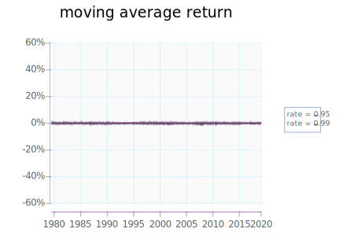

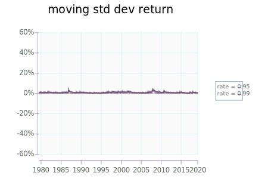

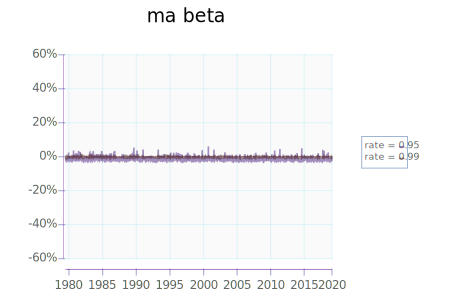

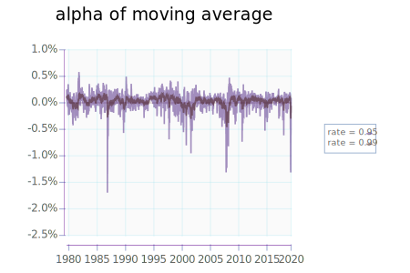

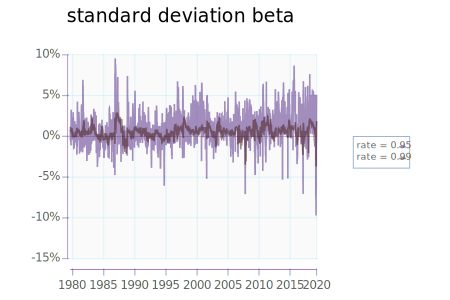


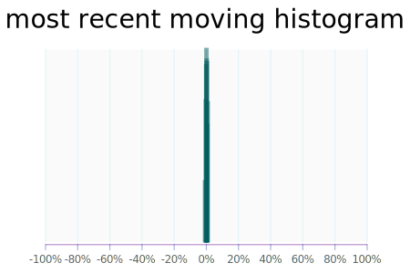

digitalise
----------

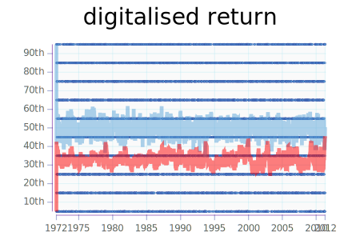

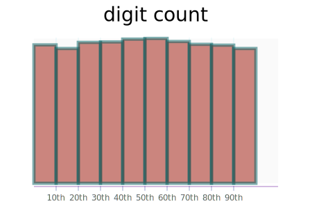

Histogram
---------

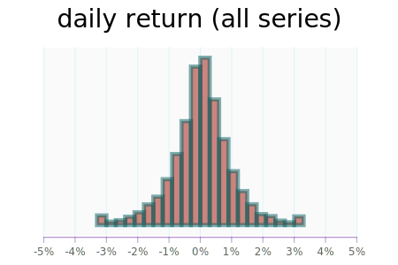

Contemporaneous relationship between moving average and moving std.

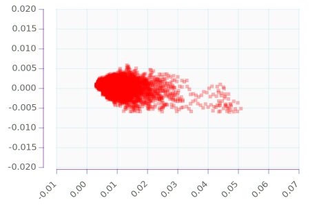

digitalized relationship

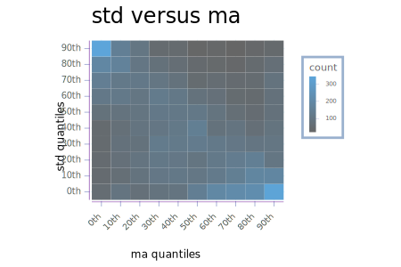
