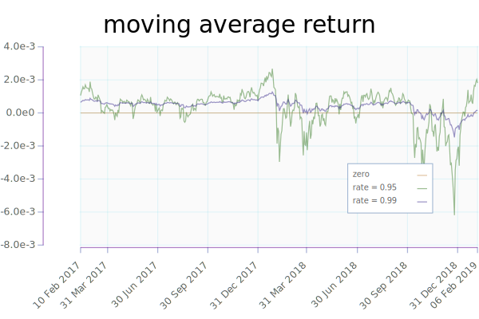
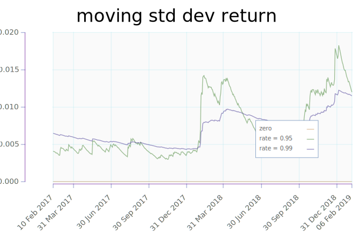
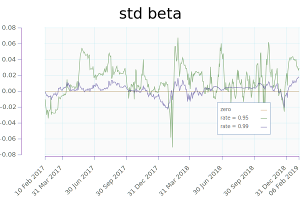
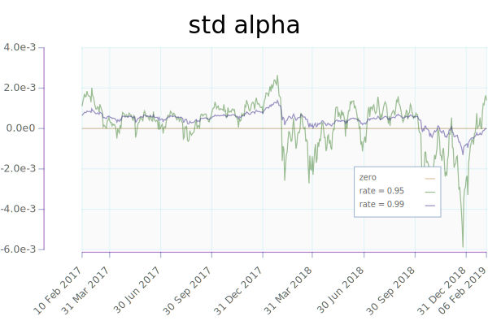
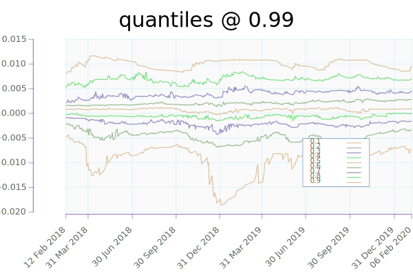
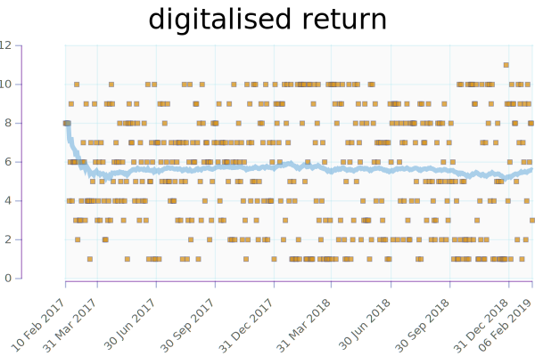
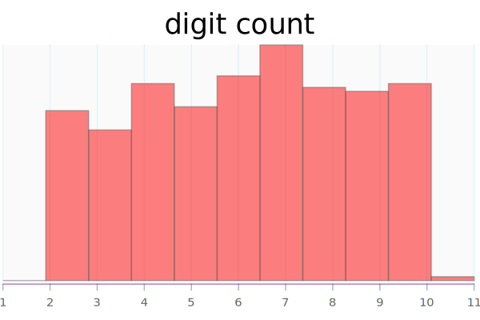
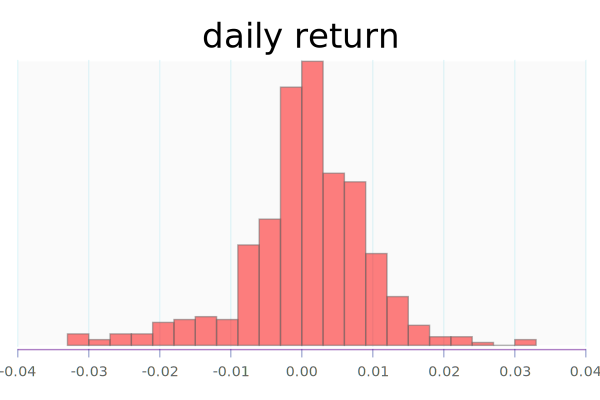

Run Configuration
---

```{.output .run}
```

Basic Statistics
---

```{.output .stats}
```

Time Series Statistics
----------------------













digitalise
----------





Histogram
---------



Contemporaneous relationship between moving average and moving std.


digitalized relationship


