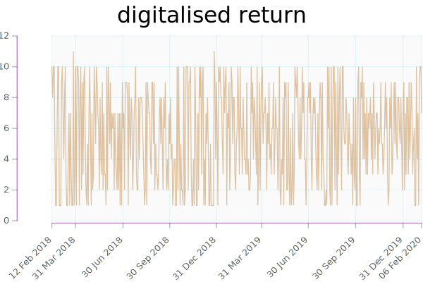

```{.output .header}
```

Run Configuration
---

```{.output .run}
```

Basic Statistics
---

```{.output .stats}
```

Rolling average return.


Rolling beta of rolling average return on next day's return.


Rolling quantiles


Return quantile



Beta of digitized return on return


