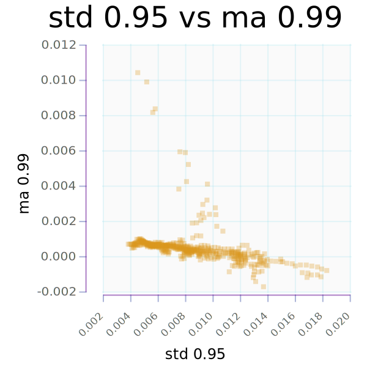

[online-market](https://tonyday567.github.io/online-market/index.html)
===

```{.output .stats}
```


scatter chart of ma 0.99 vs std 0.95



quantiles
---


histogram
---


digitalise
---


status
---

[](https://travis-ci.org/tonyday567/online-market)

~~~
stack build --exec "$(stack path --local-install-root)/bin/online-market-examples run" --file-watch
~~~
