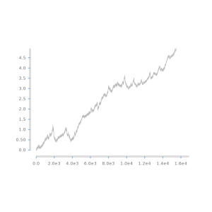
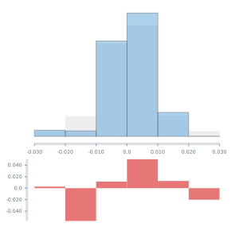
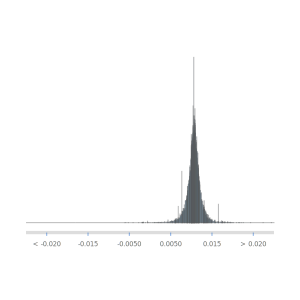
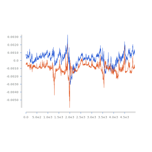
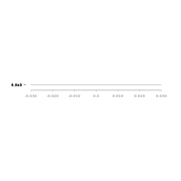
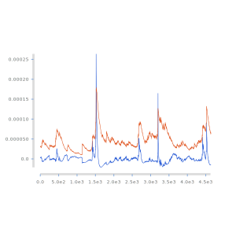
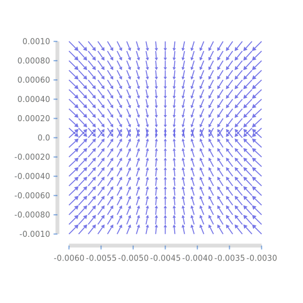

<meta charset="utf-8">
<link rel="stylesheet" href="https://tonyday567.github.io/other/lhs.css">

[online](https://tonyday567.github.io/online-dev/index.html) 
============================================================================================================================================================================

daily stock market data
-----------------------

Exploring the online library using the most data-mined time-series in
history; the S&P500 return since 1958.

An accumulation of the daily random variates:

The data is expressed in terms of log(1+return).

A histogram of daily log returns (grey background), and the most recent
histogram onlined with a rate of 0.9975:

Over the last 10 years (specifically the trend with a half-life of 4000
days), there have been a lot more days with a slightly positive return
than compared with the full history.

The full histogram coming out of tdigest:

Recent returns have been higher and less volatile than the long history.
Roll on bull market.

momentum
========

Starting with a hypothesis that the current conditional mean is related
to historical average return, we can construct a linear map as so:

$$ r_t = beta * av_o + alpha + e $$ $$ e = r_t - beta * av_o - alpha $$

Without this structure, each daily value can be seen as a surprise, so
that $e=r_t$.

We can make the results of the regression an online fold as well:

The (online) alpha regression estimate through time is orange and beta
is blue. A typical pattern for regression - terms of opposite sign
pretending to make sense of noise. This is not the get-rich droid you
are looking for.

But let's say it was. Let's look at the histograms of return, and the
residual error term if we include the conditional mean relationship:

If there is an effect of recent returns on current return stochastics,
it's small, but it does move the residual stochastics more towards a
more symetrical distribution.

fat tails
---------

We can do similar things for magnitude measures.

$$r_t**2 = beta * r2_o + alpha$$ $$r_t = (sqrt r_t**2) * e
$$e = r\_t / sqrt (beta \* r2\_o + alpha)

arrows
------

data munge
----------

https://github.com/pvdbrand/quandl-api

data is from
[yahoo](https://www.quandl.com/data/YAHOO/INDEX_GSPC-S-P-500-Index) and
consists of the following fields:

    Date,Open,High,Low,Close,Volume,Adjusted Close

Stats are soley on adjusted close.

The base unit for analysis (which I've called ys to abstract) is
log(1+return). Returns are geometric by nature, and this premap removes
the effect before we get to distributions.

quantiles
---------

    [min, 10th, 20th, .. 90th, max]: -0.229 -0.00993 -0.00555 -0.00296 -0.00108 0.000461 0.00204 0.00394 0.00623 0.0102 0.110
    online [min, 10th, 20th, .. 90th, max] with decay rate = 0.996 (one year) -0.229 -0.00777 -0.00489 -0.00282 -0.000546 0.00116 0.00260 0.00423 0.00698 0.0105 0.0494

digitize
--------

A related computation is to output the quantile of each value:

    first 100 values digitized into quantiles: 11.0 11.0 11.0 11.0 11.0 11.0 11.0 11.0 11.0 11.0 11.0 11.0 11.0 11.0 11.0 11.0 11.0 11.0 11.0 11.0 11.0 11.0 11.0 11.0 11.0 11.0 11.0 11.0 11.0 11.0 11.0 11.0 11.0 11.0 11.0 11.0 11.0 11.0 11.0 11.0 11.0 11.0 11.0 11.0 11.0 11.0 11.0 11.0 11.0 11.0 11.0 11.0 11.0 11.0 11.0 11.0 11.0 11.0 11.0 11.0 11.0 11.0 11.0 11.0 11.0 11.0 11.0 11.0 11.0 11.0 11.0 11.0 11.0 11.0 11.0 11.0 11.0 11.0 11.0 11.0 11.0 11.0 11.0 11.0 11.0 11.0 11.0 11.0 11.0 11.0 11.0 11.0 11.0 11.0 11.0 11.0 11.0 11.0 11.0 11.0

regression
==========

$$\displaystyle L(\boldsymbol{x}, \boldsymbol{y}, m, c) = \frac{1}{2n}\sum_{i=1}^n (y - (mx + c))^2$$

[ad
types](http://stackoverflow.com/questions/11654168/acceptable-types-in-numeric-ad-functions)

$$dx=A(x)dt+√​σ(t)​​​B(x)dW where W∼p?$$

workflow
--------

    stack build --copy-bins --exec "online-dev-examples run" --exec "pandoc -f markdown+lhs -t html -i examples/examples.md -o index.html --filter pandoc-include" --exec "pandoc -f markdown+lhs -t markdown -i examples/examples.md -o readme.md --filter pandoc-include"
