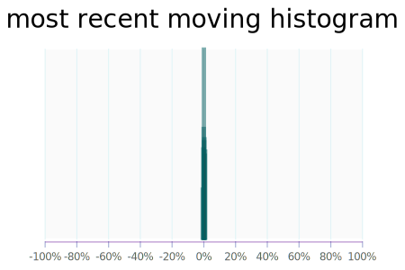
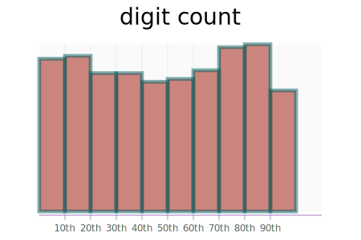
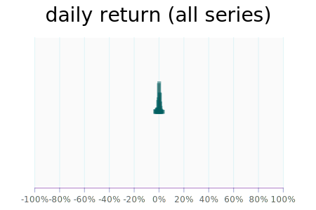
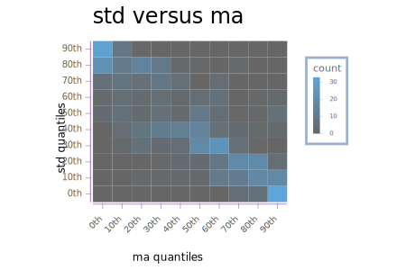
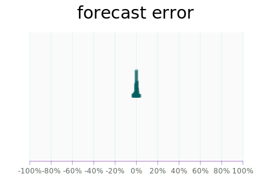
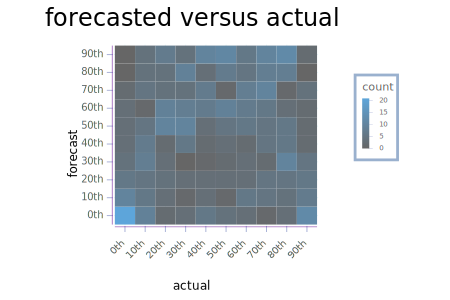

<head>
    <link rel="stylesheet" href="../../other/lhs.css">
</head>

[online-market](https://tonyday567.github.io/online-market/index.html) run
--------------------------------------------------------------------------

Run Configuration
-----------------

``` {.output .run}
RunStyleConfig {runName = "default", chartSize = Point 300.0 200.0}
RunConfig {nAll = 1000, n = 500, rates = [0.95,0.99], versus = (0.95,0.95), qs = [0.1,0.2,0.30000000000000004,0.4,0.5,0.6000000000000001,0.7000000000000001,0.8,0.9], qsRate = 0.99, foreRate = (0.99,0.99), histGrain = 20, histRange = Range -3.0e-2 3.0e-2}
```

Basic Statistics
----------------

|                         |            |
|:------------------------|-----------:|
| Start Date              |  2018-02-27|
| End Date                |  2020-02-21|
| n                       |         500|
| daily average return    |      0.037%|
| average return pa       |      9.149%|
| daily average sd return |      0.901%|
| average sd return pa    |     14.249%|

Time Series Statistics
----------------------




digitalise
----------




Histogram
---------



Contemporaneous relationship between moving average and moving std.


digitalized relationship



forecasting
-----------

|                           |        |
|:--------------------------|-------:|
| daily average forecast    |  0.036%|
| daily average sd forecast |  0.038%|





